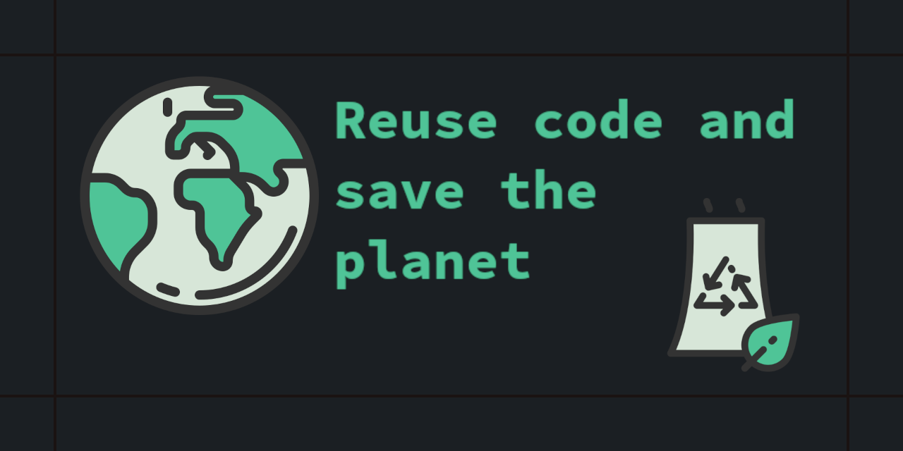

# Webpack template for github

For any javascript endeavours

Default is vanilla could work with any flavour

## A feature rich repo

 - [x] BrowserSync - browser refreshes outputs to 4200

 - [x] Github Action - builds and releases to a releas branch

 - [x] Deploy app on new pushed tag 📣 v0.0.X - Just released

 - [x] Sass enabled [Guide here](https://sass-lang.com/guide)

    Familiar with [Block Element Modifier](http://getbem.com/)

 - [ ] Travis CI file - WIP

 - [ ] Babel ?

 - [ ] React / Vue additions

### Clone and start with 

> npm start

### Build

> npm run build

Outputs to `./dist` folder

### Github setup actions

For the [workflow](.github/workflows/webpack.yml) to work you need to give it permissions to write
Go to

> Settings > Actions > General > Workflow permissions > Read and write

